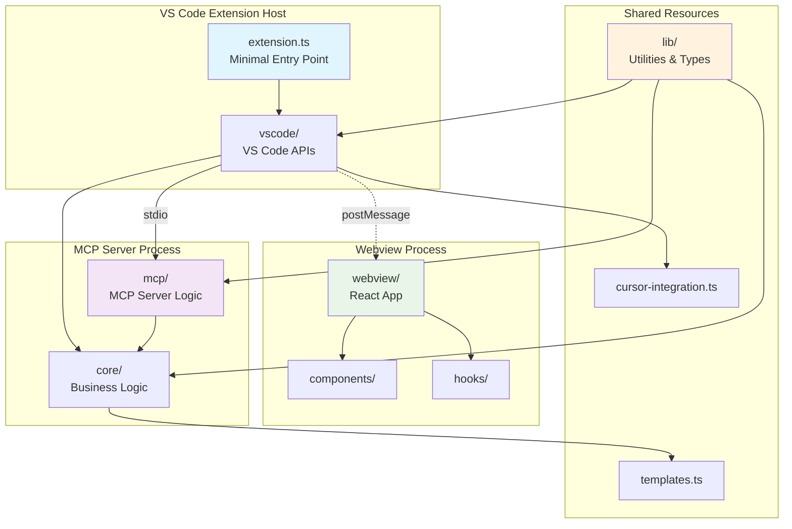
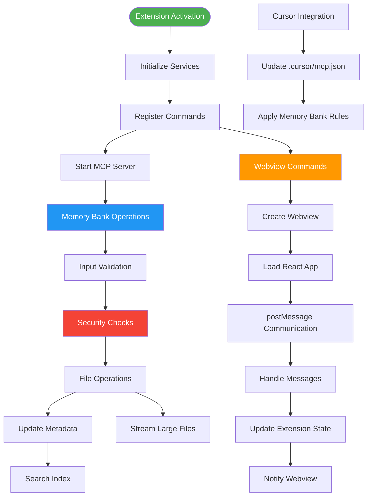

# AI Memory Extension - Project Structure Consolidation Plan

**Version:** v0.8.0-dev.5
**Date:** 2025-06-08
**Goal:** Reduce from 55 TypeScript files to 22 files (60% reduction)

## Overview

This plan consolidates the AI Memory Extension codebase while following VS Code extension best practices, achieving significant file reduction without compromising functionality or performance.

---

## 📊 Architecture Overview (Mermaid Diagram)



---

## 🔄 Data Flow & Component Interaction (Flow Chart)



---

## 📁 Consolidated File Structure (Tree Diagram)

```text
src/
├── extension.ts                    # 🎯 Minimal entry point (300 lines)
│
├── vscode/                         # 🔧 VS Code Integration (3 files)
│   ├── webview-provider.ts         # Webview creation & postMessage (450 lines)
│   ├── commands.ts                 # All extension commands (400 lines)
│   └── workspace.ts                # Configuration & workspace mgmt (350 lines)
│
├── mcp/                           # 🚀 MCP Server (3 files)
│   ├── server.ts                  # Server logic & tool registry (450 lines)
│   ├── tools.ts                   # All MCP tools implementation (550 lines)
│   └── transport.ts               # stdio communication (300 lines)
│
├── core/                          # 💼 Business Logic (4 files)
│   ├── memory-bank.ts             # Memory bank operations (500 lines)
│   ├── file-operations.ts         # Core file I/O with retries (300 lines)
│   ├── streaming.ts               # File streaming & management (450 lines)
│   └── metadata.ts                # Search index & metadata (350 lines)
│
├── lib/                           # 🛠️ Shared Utilities (5 files)
│   ├── types/                     # Type definitions (3 files)
│   │   ├── core.ts                # Core types (memory bank, errors, logging) (400 lines)
│   │   ├── operations.ts          # File ops, MCP, validation types (450 lines)
│   │   └── system.ts              # Cache, config, metadata types (400 lines)
│   ├── validation.ts              # Zod schemas & security (350 lines)
│   ├── utils.ts                   # System, logging & VSCode-specific utilities (~250 lines)
│   ├── helpers.ts                 # General-purpose pure functions (string, date, etc.) (~200 lines)
│   └── di-container.ts            # Dependency injection container (~50 lines)
│
├── cursor-integration.ts          # 🎯 Cursor MCP config & rules (~400 lines)
├── templates/                     # 📋 All Templates (5 files)
│   ├── core.ts                    # Core memory bank templates (300 lines)
│   ├── tech.ts                    # Technology context templates (350 lines)
│   ├── system.ts                  # System patterns templates (280 lines)
│   ├── progress.ts                # Progress tracking templates (250 lines)
│   └── memory-bank-rules.md       # Memory bank rules template (150 lines)
│
├── webview/                       # ⚛️ React App (unchanged)
│   └── src/...                    # React components, hooks, etc.
│
└── assets/                        # 🎨 Static Resources
```

---

## 📈 Consolidation Metrics

| Category | Before | After | Reduction |
|----------|--------|-------|-----------|
| **TypeScript Files** | 55 | 22 | 60% |
| **Folders** | 15+ | 6 | 60% |
| **Main Logic Files** | 25+ | 12 | 52% |
| **Utility Files** | 12 | 5 | 58% |
| **Template Files** | 5 | 5 | 0% |

---

## 🎯 Key Design Principles

### **Performance First**

- Minimal `extension.ts` for fast activation
- Lazy loading of heavy dependencies
- Efficient webview communication patterns

### **Security Focused**

- Centralized input validation in `lib/validation.ts`
- Path traversal protection in `lib/security.ts`
- CSP compliance for webview

### **Maintainability**

- Logical grouping by function, not arbitrary limits
- Clear separation of concerns
- Single responsibility per consolidated file

### **VS Code Best Practices**

- Extension host vs. webview process separation
- Proper disposal patterns for resources
- Error boundaries and graceful degradation

---

## 🔄 Migration Strategy

### **Phase 1: Create New Structure**

1. Create new consolidated files with appropriate exports
2. Move and merge existing functionality
3. Update imports throughout codebase

### **Phase 2: Update Build System**

1. Update `rollup.config.js` path aliases
2. Modify `tsconfig.json` path mappings
3. Update test configurations

### **Phase 3: Validation**

1. Run full test suite
2. Validate extension packaging
3. Test MCP server functionality
4. Verify webview communication

### **Phase 4: Cleanup**

1. Remove old file structure
2. Update documentation
3. Clean up unused imports
4. Final linting and formatting

---

## 🚦 Success Criteria

- [ ] All 22 target files created and populated
- [ ] Extension activates in <2 seconds
- [ ] All MCP tools functional
- [ ] Webview communication working
- [ ] Test suite passes (>80% coverage)
- [ ] Build system updated and working
- [ ] Documentation reflects new structure

---

**Last Updated:** 2025-06-08
**Status:** Planning Phase
**Next Steps:** Begin Phase 1 implementation
