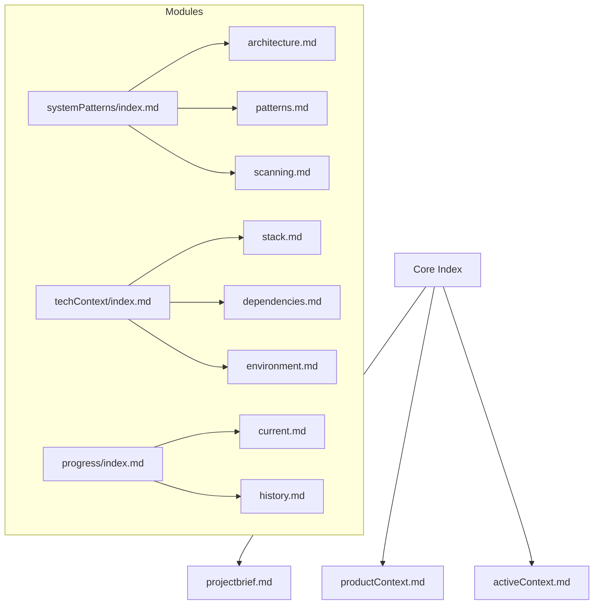
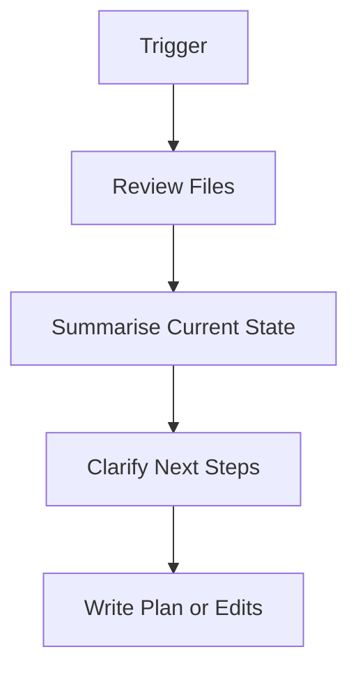

# 🧠 Cursor Memory Bank Rules (AI Memory v0.1.2+)

Welcome to the AI Memory system. This file acts as the blueprint for how Cursor understands and works with your Memory Bank. It will be transformed automatically into `.cursor/rules/memory-bank.mdc` by the AI Memory extension on first initialization.

## 🧠 Reset & Load

-   On every session reset, run `read-memory-bank-files()`
-   Always load:
    -   `core/*.md`
    -   `progress/current.md`, `progress/history.md`
    -   `systemPatterns/index.md`, `techContext/index.md`
-   Other files are loaded lazily when contextually required

## 🔥 Memory Tiering

| Tier | Files                              | Access Rule               |
| ---- | ---------------------------------- | ------------------------- |
| Hot  | `core/*.md`, `progress/current.md` | Always load immediately   |
| Warm | `systemPatterns/index.md`          | Load on plan or diagnosis |
| Cold | >30KB files, old history           | Load chunked or deferred  |

## 📏 File Size Guidelines

-   `< 15KB`: Load freely
-   `15–30KB`: Warn, consider chunking
-   `> 30KB`: Chunked access required via `chunkIndex`
-   Limit to 5 parallel loads

## 📂 Memory Bank Structure

## 🧭 Plan Mode

-   Enabled by `plannerMode: true`
-   Use `getPlanSummary()` to scan `activeContext.md` and `current.md`
-   Ask 4–6 questions before proposing a plan
-   Present plan to user and apply with `update-current-plan`

## 🔐 Safety Rules

-   Never overwrite `projectBrief.md` or `productContext.md`
-   Never write to any `index.md` file
-   Always prompt before modifying `progress/current.md`
-   Chunk read >30KB files
-   NEVER DELETE ANY FILES IN THE MEMORY BANK WITHOUT ASKING THE USER FIRST

## 🛠 Required MCP Tools

| Tool                       | Purpose                   |
| -------------------------- | ------------------------- |
| `read-memory-bank-files`   | Full memory scan on reset |
| `get-memory-bank-file`     | Targeted file read        |
| `update-memory-bank-file`  | Safe writes               |
| `get-memory-bank-metadata` | File size + status        |
| `initialize-memory-bank`   | Initial scaffolding       |
| `update-current-plan`      | Modify current roadmap    |

## 📜 Documentation Updates

This file will be read by `cursor-rules-service.ts` and compiled into a `.mdc` format for rule execution.

_Last updated: Synthesized from AI Memory v0.1.2 canonical `.mdc`_
