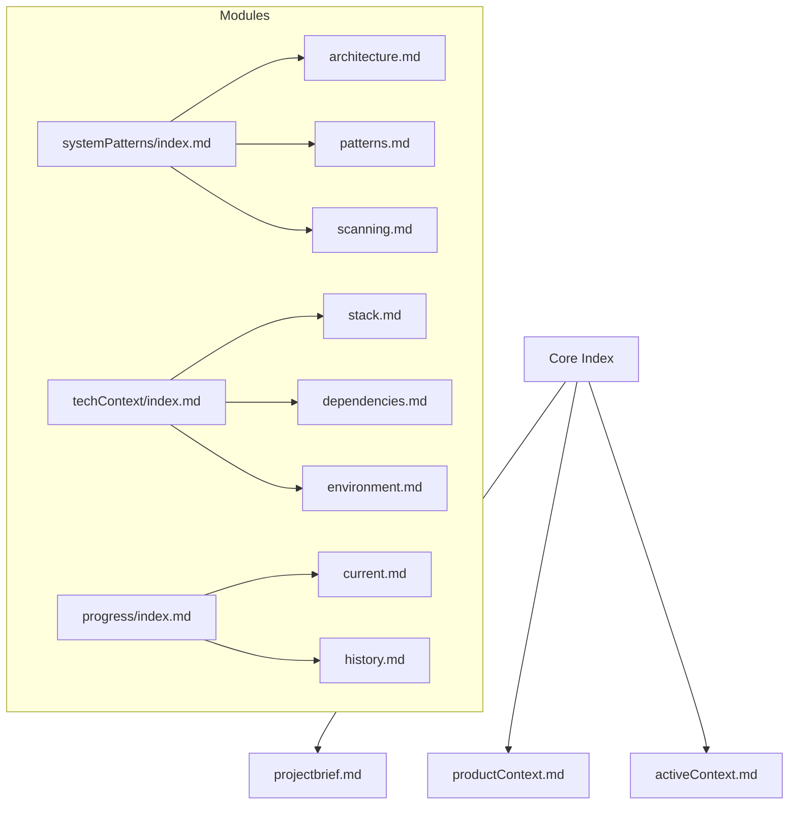
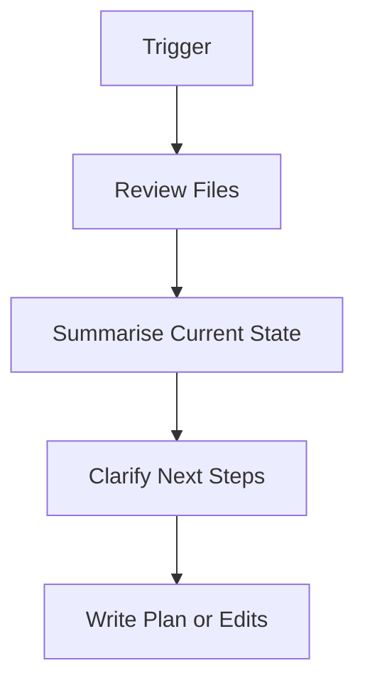

# 🧠 Cursor Memory Bank Rules (AI Memory v0.1.2+)

Welcome to the AI Memory system. This file acts as the blueprint for how Cursor understands and works with your Memory Bank. It will be transformed automatically into `.cursor/rules/memory-bank.mdc` by the AI Memory extension on first initialization.

## 🧠 Reset & Load

-   On every session reset, run `read-memory-bank-files()`
-   Always load:
    -   `core/*.md`
    -   `progress/current.md`, `progress/history.md`
    -   `systemPatterns/index.md`, `techContext/index.md`
-   Other files are loaded lazily when contextually required

## 🔥 Memory Tiering

| Tier | Files                              | Access Rule               |
| ---- | ---------------------------------- | ------------------------- |
| Hot  | `core/*.md`, `progress/current.md` | Always load immediately   |
| Warm | `systemPatterns/index.md`          | Load on plan or diagnosis |
| Cold | >30KB files, old history           | Load chunked or deferred  |

## 📏 File Size Guidelines

-   `< 15KB`: Load freely
-   `15–30KB`: Warn, consider chunking
-   `> 30KB`: Chunked access required via `chunkIndex`
-   Limit to 5 parallel loads

## 📂 Memory Bank Structure

## 🧭 Plan Mode

-   Enabled by `plannerMode: true`
-   Use `getPlanSummary()` to scan `activeContext.md` and `current.md`
-   Ask 4–6 questions before proposing a plan
-   Present plan to user and apply with `update-current-plan`

## 🔐 Safety Rules

-   Never overwrite `projectBrief.md` or `productContext.md`
-   Never write to any `index.md` file
-   Always prompt before modifying `progress/current.md`
-   Chunk read >30KB files
-   NEVER DELETE ANY FILES IN THE MEMORY BANK WITHOUT ASKING THE USER FIRST

## 🛠 Required MCP Tools

| Tool                       | Purpose                   |
| -------------------------- | ------------------------- |
| `read-memory-bank-files`   | Full memory scan on reset |
| `get-memory-bank-file`     | Targeted file read        |
| `update-memory-bank-file`  | Safe writes               |
| `get-memory-bank-metadata` | File size + status        |
| `initialize-memory-bank`   | Initial scaffolding       |
| `update-current-plan`      | Modify current roadmap    |

## 📜 Documentation Updates

This file will be read by `cursor-rules-service.ts` and compiled into a `.mdc` format for rule execution.

_Last updated: Synthesized from AI Memory v0.1.2 canonical `.mdc`_

# 🛠️ Thoughtful Use of Available MCP Tools

To ensure robust, up-to-date, and best-practice solutions when working with the memory bank or extension, the AI agent should thoughtfully use all available MCP tools in this environment, including but not limited to:

- **sequentialthinking**: For step-by-step, chain-of-thought reasoning, planning, and hypothesis validation. Use this tool to break down complex problems, validate plans, and check for missed edge cases.
- **perplexity**: For research, web search, and fetching up-to-date documentation or best practices. Use this tool when encountering errors, uncertainty, or when the latest information is needed.
- **context7**: For accessing official documentation, code examples, and checking for deprecations or usage patterns in libraries and frameworks.

**Guidelines:**
- Use these tools whenever reasoning about complex changes, validating plans, or when up-to-date information is required.
- Prefer tool-assisted reasoning over assumptions, especially for ambiguous or high-impact tasks.
- Document in the memory bank when a tool was used to inform a decision or plan.
- If the user requests, always use the specified tool for their query.

This ensures that all memory bank operations and extension development are grounded in the best available knowledge and practices. 🐹

# 🧠 Implementation Notes & Best Practices (2025-05-11)

- **Self-healing:** The extension will auto-create any missing required files/folders on startup or access, using templates. This is considered safe and does not require user consent.
- **Shared core logic:** Both CLI and extension/server must use the same context-agnostic core logic for all memory bank operations.
- **Cursor config automation:** The extension will automatically update `.cursor/mcp.json` to ensure Cursor can find the MCP server.
- **Chunked file access:** Chunked file access is planned but not yet implemented. For now, all reads are full-file, with warnings for large files.
- **Plan mode:** Plan mode and the `/plan` tool are planned features, not yet implemented. For now, planning is handled via manual updates to `progress/current.md` and `core/activeContext.md`.
- **Webview UI:** The webview UI provides controls for memory bank status, repair, and server management, surfacing self-healing and error feedback to the user.
- **Consent for sensitive operations:** All file overwrites (except self-healing) require user consent. `memory-bank.mdc` may only be regenerated or overwritten with explicit user consent.
