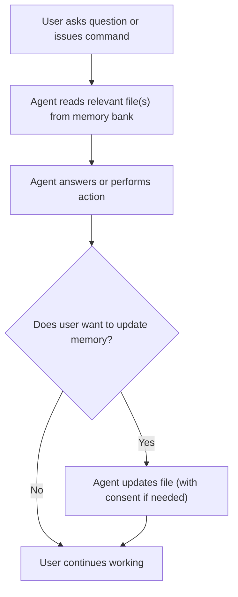
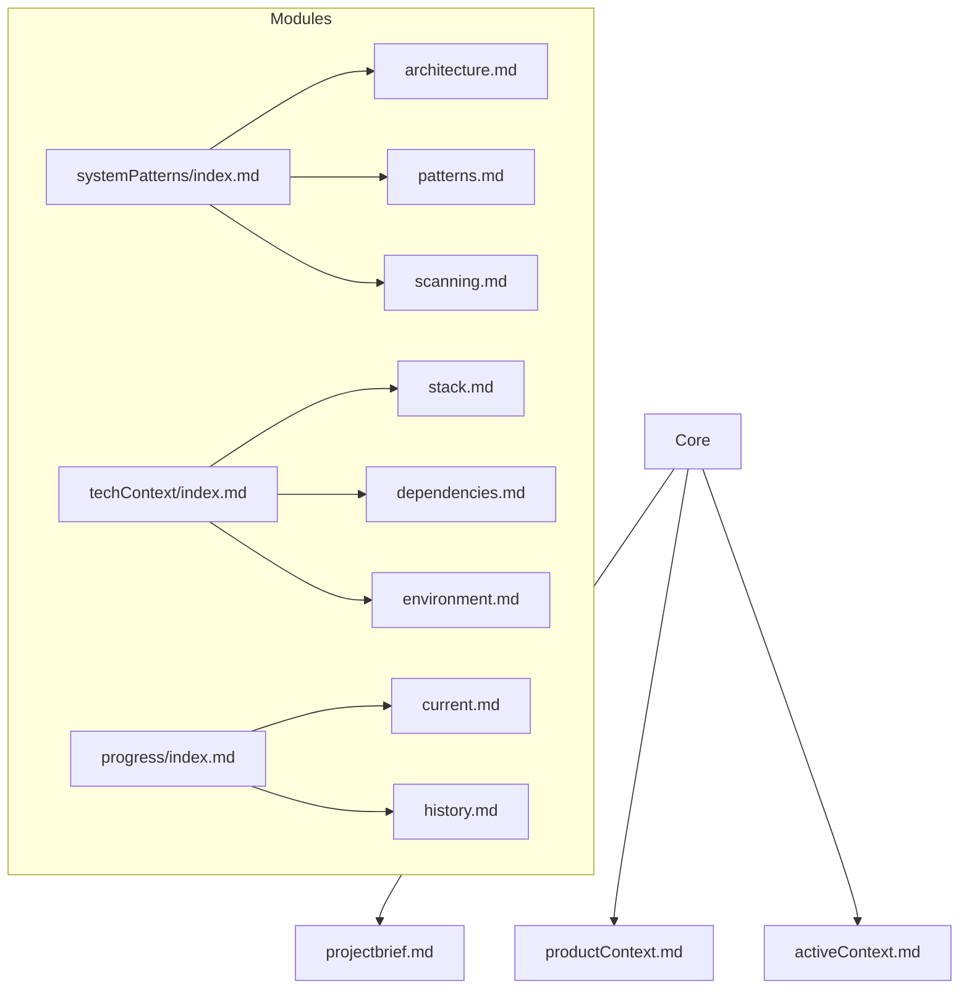
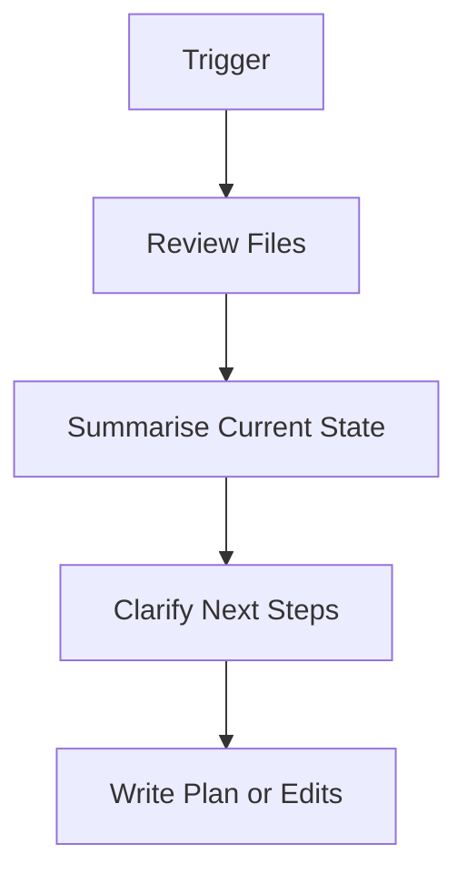

# Cursor Memory Bank Rules (AI Memory v0.3.0+)

Welcome to the AI Memory system. This file acts as the blueprint for how Cursor understands and works with your Memory Bank. It will be transformed automatically into `.cursor/rules/memory-bank.mdc` by the AI Memory extension on first initialization.

## Reset & Load

- On every session reset, run `read-memory-bank-files()`
- Always load:
  - `core/*.md`
  - `progress/current.md`, `progress/history.md`
  - `systemPatterns/index.md`
  - `techContext/index.md`
- Other files are loaded lazily when contextually required

## Memory Tiering

| Tier | Files                              | Access Rule               |
| ---- | ---------------------------------- | ------------------------- |
| Hot  | `core/*.md`, `progress/current.md` | Always load immediately   |
| Warm | `systemPatterns/index.md`          | Load on plan or diagnosis |
| Cold | >30KB files, old history           | Load chunked or deferred  |

## File Size Guidelines

- `< 15KB`: Load freely
- `15–30KB`: Warn, consider chunking
- `> 30KB`: Chunked access required via `chunkIndex`
- Limit to 5 parallel loads

## Safety Rules

- Never overwrite `projectBrief.md` or `productContext.md`
- Always prompt before modifying `progress/current.md`
- Chunk read >30KB files

## Memory Bank Flow

## Memory Bank Structure

## Documentation Updates

## Required MCP Tools

| Tool                       | Purpose                   |
| -------------------------- | ------------------------- |
| `read-memory-bank-files`   | Full memory scan on reset |
| `get-memory-bank-file`     | Targeted file read        |
| `update-memory-bank-file`  | Safe writes               |
| `get-memory-bank-metadata` | File size + status        |
| `initialize-memory-bank`   | Initial scaffolding       |
| `update-current-plan`      | Modify current roadmap    |

## Implementation Notes & Best Practices

- Self-healing: The extension will auto-create any missing required files/folders on startup or access, using templates. This is considered safe and does not require user consent.
- Shared core logic: Both CLI and extension/server must use the same context-agnostic core logic for all memory bank operations.
- Cursor config automation: The extension will automatically update `.cursor/mcp.json` to ensure Cursor can find the MCP server.
- Consent for sensitive operations: All file overwrites (except self-healing) require user consent. `memory-bank.mdc` may only be regenerated or overwritten with explicit user consent.

This file will be read by `cursor-rules-service.ts` and compiled into a `.mdc` format for rule execution.

Cursor agents should regularly check the .cursor/rules/ directory for other rulesets that may affect project behaviour.

>_Last updated: 2025-05-18_
