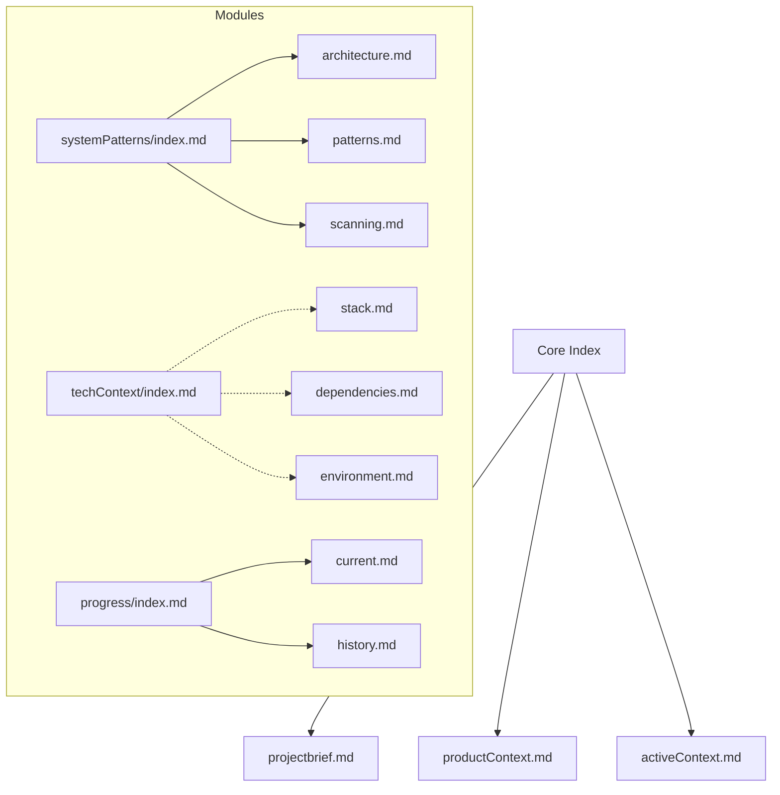
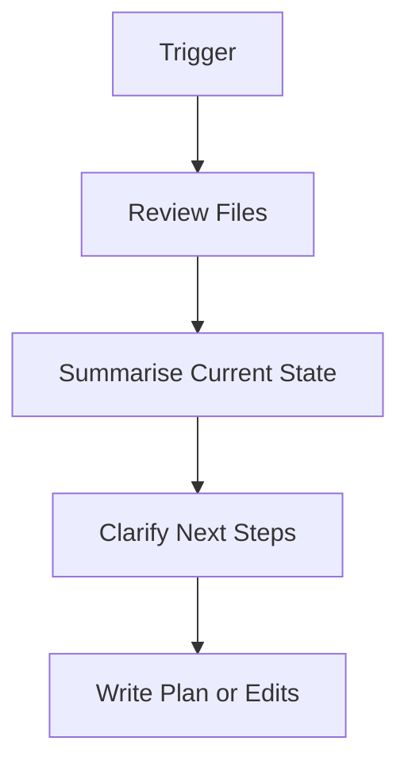

# Cursor Memory Bank Rules (AI Memory v0.8.0+)

Welcome to the AI Memory system. This file acts as the blueprint for how Cursor understands and works with your Memory Bank. It will be transformed automatically into `.cursor/rules/memory-bank.mdc` by the AI Memory extension on first initialization.

## 🧠 Reset & Load

- On every session reset, run `read-memory-bank-files()`
- Always load:
  - `core/*.md`
  - `progress/current.md`, `progress/history.md`
  - `systemPatterns/index.md`
  - `techContext/index.md`
  - `techContext/stack.md`, `techContext/dependencies.md`, `techContext/environment.md`  # Created during documentation bootstrap
- Other files are loaded lazily or created on demand when contextually required.
- Failover and retry logic should be applied if a file is missing or corrupted.

## 🔥 Memory Tiering

| Tier | Files                              | Access Rule               |
| ---- | ---------------------------------- | ------------------------- |
| Hot  | `core/*.md`, `progress/current.md` | Always load immediately   |
| Warm | `systemPatterns/index.md`          | Load on plan or diagnosis |
| Cold | ≥15 KB files, old history           | Read on demand (no streaming) |

## 📏 File Size Guidelines

- `< 15KB`: Load freely
- `15–30KB`: Warn, consider splitting the content into multiple docs
- `≥ 15 KB`: Warn about size; consider splitting file or keep as on-demand read
- Limit parallel reads to 5; warn if more than 8 files are read concurrently

## 🔐 Safety Rules

- Never overwrite `projectBrief.md` or `productContext.md`
- NEVER write to any `index.md` file
- Always prompt before modifying `progress/current.md`
- For files ≥15 KB read lazily; no streaming or chunking logic needed
- NEVER DELETE any memory-bank file without explicit user approval
- Mark all dangerous operations in logs and surface in UI if available

## 📝 Content Quality Rules

- **MD040 Compliance**: All fenced code blocks in memory bank files MUST specify a language identifier
  - ✅ Correct: ````markdown```typescript``` or````markdown```bash```
  - ❌ Incorrect: ````markdown``````
  - Apply this rule when creating, editing, or updating any `@/memory-bank` file
- Ensure consistent markdown formatting across all memory bank documentation

## 📂 Memory Bank Structure



- Only `techContext/index.md` is created on initialization.
- The other tech files are generated if/when the user or AI requests more detailed separation.

## 🧭 Plan Mode

- `plannerMode: true`
- Use `getPlanSummary()` to scan `activeContext.md` and `current.md`
- Ask clarifying questions when assumptions are unclear (typically 4–6 for new contexts)
- Validate assumptions against `productContext.md`
- Present plan clearly and apply using `update-memory-bank-file()` (explicit user confirmation required)

## 🛠 Core MCP Tools

| Tool                              | Purpose and Invocation                   |
| --------------------------------- | ---------------------------------------- |
| `init-memory-bank()`              | Initialize memory bank folders and files |
| `read-memory-bank-files()`        | Full memory scan on session reset        |
| `update-memory-bank-file()`       | Update file contents safely              |
| `list-memory-bank-files()`        | List files with metadata                 |
| `health-check-memory-bank()`      | Check memory bank health status          |
| `read-memory-bank-file()`         | Read single file by type (CLI mode)      |
| `review-and-update-memory-bank()` | Interactive file review workflow         |

## 🔍 Advanced MCP Tools (Roadmap – Phase 2)

// Future capabilities – not available to end-users yet

## 📜 Documentation Flow



## 🧠 Notes for Cursor Agent Developers

- Enforce safety rules in UI interactions and MCP tools.
- Use metadata to filter large or outdated files.
- Confirm edits and deletions through prompts or modals.
- Cross-check edits against `core/activeContext.md` and `productContext.md` when `plannerMode` is enabled.

## 🛠️ Thoughtful Use of Available MCP Tools

*(For detailed reasoning strategy, tool selection matrix, and logging patterns see **@004-ai-reasoning-strategy.mdc**.)*

To ensure robust, up-to-date, and best-practice solutions when working with the memory bank or extension, the AI agent should thoughtfully use all available MCP tools in this environment, including but not limited to:

- **clear-thought**: For step-by-step, chain-of-thought reasoning, planning, and hypothesis validation. Use this tool to break down complex problems, validate plans, and check for missed edge cases.
- **context7**, **codex-keeper** and/or **docshunter**: For accessing official documentation, best practices, code examples, and checking for deprecations or usage patterns in libraries and frameworks.

### Guidelines

- Use these tools whenever reasoning about complex changes, validating plans, or when up-to-date information is required.
- Prefer tool-assisted reasoning over assumptions, especially for ambiguous or high-impact tasks.
- Document in the memory bank when a tool was used to inform a decision or plan.
- If the user requests, always use the specified tool for their query.

This ensures that all memory bank operations and extension development are grounded in the best available knowledge and practices.

## Implementation Notes & Best Practices

- Self-healing: The extension will auto-create any missing required files/folders on startup or access, using templates. This is considered safe and does not require user consent.
- Consent for sensitive operations: All file overwrites (except self-healing) require user consent. `memory-bank.mdc` may only be regenerated or overwritten with explicit user consent.

This file will be read by `cursor-rules-service.ts` and compiled into a `.mdc` format for rule execution.

Cursor agents should regularly check the .cursor/rules/ directory for other rulesets that may affect project behaviour.

> *Last updated: 2025-06-11*
